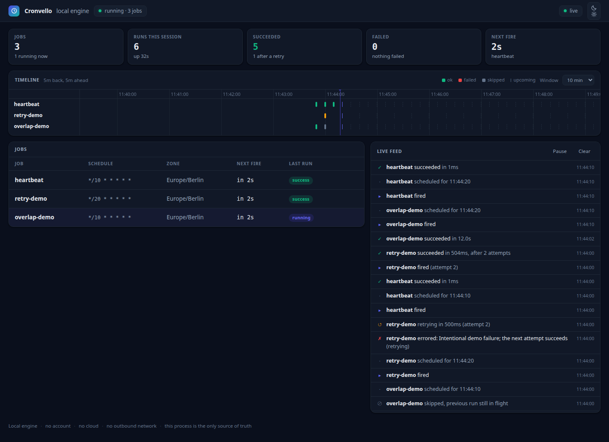

# Watch a cron job fail and recover

A small, local Cronvello demo: a successful job, a deliberate failure followed by
a retry, and a job that takes longer than its interval. No account or API key.



Actual local demo output with synthetic jobs.

Requires Node.js 20 or newer. The JavaScript configuration runs without a TypeScript loader.

## Run it

In a new folder, install the SDK:

```bash
npm install @cronvello/sdk
```

Save [cronvello.config.mjs](./cronvello.config.mjs) in that folder, then run:

```bash
npx cronvello dev --dashboard
```

Open **http://127.0.0.1:4747**. Leave it running for about 30 seconds.

| Job | What to look for |
| --- | --- |
| `heartbeat` | A successful run every 10 seconds. |
| `retry-demo` | An intentional error, followed by a successful retry. |
| `overlap-demo` | A 12-second handler on a 10-second schedule; the overlapping tick is skipped. |

The demo only logs messages and waits. It does not contact production services,
send emails, or modify files. The initial npm install requires an internet connection;
the demo itself runs locally.

## Inspect without running handlers

```bash
npx cronvello dev --dry-run --window 30s
```

Stop the scheduler with **Ctrl+C**. In-flight handlers finish first, so the demo may take up to 12 seconds to exit; the dashboard then closes with it.

## Where the local demo ends

The scheduler and its in-memory run history live in this process. Closing it stops
the jobs and loses that history. This example is not a persistent queue or an
external uptime monitor. Handlers with external side effects still need their
own idempotency strategy.

[Cronvello's hosted scheduler](https://cronvello.com/?utm_source=github&utm_medium=referral&utm_campaign=local_demo)
is an optional next step for HTTP jobs that need scheduling outside your deployment.
The local engine is MIT licensed and does not require that service.
